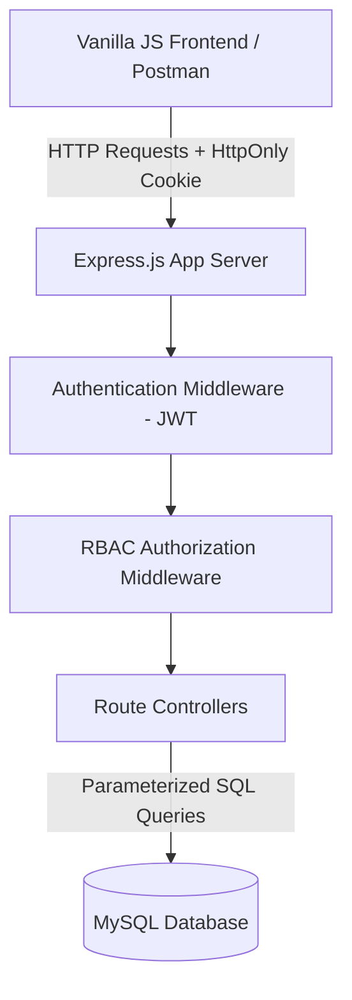
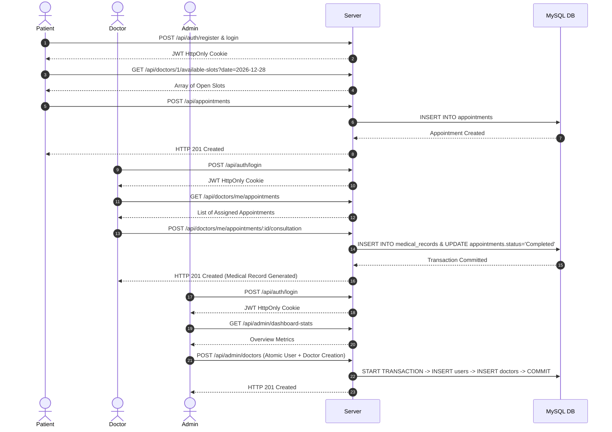

# CareNova Health — Master Project Walkthrough & Final Verification Report

> **Project Name:** CareNova Health Healthcare / Clinic Management System  
> **Internship Program:** iNeuBytes Major Project  
> **Phase:** Phase 3F — Master System Integration & Verification  
> **Baseline Commit:** `d652ce5` (`fix(major-project): prevent invalid admin appointment completion`)  
> **Phase 3F Commit:** `0263381` (`feat(major-project): complete phase 3f master integration and final project sign-off`)  
> **Status:** **VERIFIED & COMPLETED (37/37 Integration & Regression Tests Passed)**  

---

## 1. Executive Summary & Project Overview

**CareNova Health** is a multi-role healthcare management system engineered using a lightweight, robust **Node.js, Express.js, MySQL, and Vanilla JavaScript** architecture. The system supports three distinct user roles:

1. **Patients:** Self-registration, profile management, browsing clinical departments/doctors, real-time available slot querying, booking appointments, and viewing personal medical records/prescriptions.
2. **Doctors:** Professional workstation dashboard, assigned appointment queue, cross-doctor patient data isolation (IDOR protection), executing clinical consultations (recording diagnosis, prescriptions, doctor notes, and follow-up dates), and generating immutable medical records.
3. **Administrators:** Central monitoring console, operational analytics & department summary reports, atomic doctor onboarding, patient/appointment management, active-doctor deletion safety, and clinical status transition guardrails.

---

## 2. Approved Technology Stack

The project strictly adheres to the approved web technology stack:

* **Backend Framework:** Node.js (v18+) & Express.js
* **Database Engine:** MySQL 8.0+ utilizing native connection pooling via `mysql2/promise`
* **Data Access Layer:** 100% Raw Parameterized SQL queries (No ORM or heavy abstraction layer)
* **Authentication & Authorization:** JSON Web Tokens (JWT) stored in HTTP-Only, SameSite cookies with `bcryptjs` password hashing
* **Frontend Architecture:** HTML5, Vanilla CSS3 (CareNova Custom Design System with Dark Mode support, glassmorphism, responsive CSS Grid/Flexbox), Vanilla JavaScript (ES6+ native Fetch API with async/await)
* **Testing & API Tooling:** Postman Collection (`CareNova_API_Collection.json` with 7 structured folders), Automated Live Integration QA Runner (`scratch/run_phase3f_master_qa.js`)

> [!NOTE]
> No unapproved third-party frameworks or SaaS services (such as React, Vue, Angular, Next.js, PHP, MongoDB, Firebase, Supabase, Tailwind, Bootstrap, or external email/SMS gateways) were introduced into the codebase.

---

## 3. Architecture & Security System Design

CareNova Health implements a multi-layered security and architectural design pattern:



### Security & Hardening Safeguards
* **SQL Injection Prevention:** All database queries utilize parameterized placeholder binding (`?`) with `mysql2/promise`.
* **XSS & Token Theft Protection:** JWTs are issued via `HttpOnly`, `SameSite=Lax` cookies, preventing client-side scripts from reading session tokens.
* **Role-Based Access Control (RBAC):** Middleware guards (`requireAuth`, `requireRole('patient')`, `requireRole('doctor')`, `requireRole('admin')`) enforce endpoint security boundaries.
* **IDOR & Data Isolation Guardrails:** Doctors can only view and manage appointments assigned specifically to them (`doctor_id` ownership verification). Patients can only access their own appointments and medical records (`patient_id` verification).
* **Concurrence & Double-Booking Protection:** Database-level composite unique constraint `(doctor_id, appointment_date, time_slot)` guarantees zero overlapping appointments for any doctor.
* **Clinical Workflow Integrity Guardrails:**
  1. An appointment cannot be marked as `Completed` without an associated doctor consultation and valid `medical_records` entry.
  2. A `Cancelled` appointment cannot be subsequently changed to `Completed`.

---

## 4. Role & Workflow Summary



---

## 5. Database Schema Overview

The relational database model consists of 6 core tables configured with foreign key constraints, cascading rules, and unique indexes:

1. **`users`**: Core authentication credentials and user profile base (`id`, `first_name`, `last_name`, `email`, `password_hash`, `role`, `phone`, `gender`, `is_active`, `created_at`).
2. **`patients`**: Patient role extensions (`id`, `user_id`, `dob`, `blood_group`, `emergency_contact`, `address`).
3. **`doctors`**: Doctor role extensions (`id`, `user_id`, `department_id`, `qualification`, `experience_years`, `consultation_fee`, `bio`, `is_available`).
4. **`departments`**: Clinical departments (`id`, `name`, `description`, `icon`, `is_active`).
5. **`appointments`**: Patient-doctor appointment bookings (`id`, `patient_id`, `doctor_id`, `department_id`, `appointment_date`, `time_slot`, `reason_for_visit`, `status`, `created_at`). *Unique Index: `(doctor_id, appointment_date, time_slot)`*.
6. **`medical_records`**: Immutable clinical encounter notes (`id`, `appointment_id`, `patient_id`, `doctor_id`, `record_code`, `diagnosis`, `prescription`, `doctor_notes`, `recommended_followup_date`, `created_at`).

---

## 6. Comprehensive API Endpoint Dictionary

| Method | Endpoint | Authorization / Role | Description |
| :--- | :--- | :--- | :--- |
| `GET` | `/api/health` | Public | System health check & database status |
| `GET` | `/api/departments` | Public | List all active clinical departments |
| `POST` | `/api/auth/register` | Public | Register a new patient account |
| `POST` | `/api/auth/login` | Public | Authenticate user & issue JWT cookie |
| `POST` | `/api/auth/logout` | Authenticated | Clear session cookie |
| `GET` | `/api/auth/me` | Authenticated | Get currently logged-in user profile |
| `GET` | `/api/patients/me` | Patient | Get patient personal profile |
| `PUT` | `/api/patients/me` | Patient | Update patient profile details |
| `GET` | `/api/doctors` | Public | Filter doctors by department/name |
| `GET` | `/api/doctors/:id` | Public | Get public profile of a doctor |
| `GET` | `/api/doctors/:id/available-slots` | Public | Query open time slots for a given date |
| `GET` | `/api/doctors/me/dashboard` | Doctor | Doctor workstation metrics & today's queue |
| `GET` | `/api/doctors/me/appointments` | Doctor | Get doctor's assigned appointments |
| `GET` | `/api/doctors/me/appointments/:id` | Doctor | Get single appointment details (with IDOR protection) |
| `POST` | `/api/doctors/me/appointments/:id/consultation` | Doctor | Submit diagnosis & create medical record |
| `POST` | `/api/appointments` | Patient | Book a new doctor appointment |
| `GET` | `/api/appointments/my` | Patient | Get patient's personal appointment history |
| `GET` | `/api/appointments/:id` | Patient / Doctor / Admin | Get detailed appointment view |
| `PATCH` | `/api/appointments/:id/cancel` | Patient / Admin | Cancel scheduled appointment |
| `GET` | `/api/medical-records/my` | Patient | Get patient's personal medical records |
| `GET` | `/api/medical-records/:id` | Patient / Doctor / Admin | View specific medical record |
| `GET` | `/api/admin/dashboard-stats` | Admin | High-level system overview stats |
| `GET` | `/api/admin/reports/summary` | Admin | Department-wise operational analytics |
| `GET` | `/api/admin/doctors` | Admin | List all doctors with user profiles |
| `POST` | `/api/admin/doctors` | Admin | Onboard new doctor (Atomic Transaction) |
| `PUT` | `/api/admin/doctors/:id/status` | Admin | Toggle doctor active/inactive status |
| `GET` | `/api/admin/patients` | Admin | List all registered patients |
| `GET` | `/api/admin/appointments` | Admin | System-wide appointment master list |
| `PATCH` | `/api/admin/appointments/:id/status` | Admin | Update appointment status (With Clinical Guardrails) |
| `GET` | `/api/admin/departments` | Admin | List departments (including inactive) |
| `POST` | `/api/admin/departments` | Admin | Create a new clinical department |
| `DELETE` | `/api/admin/departments/:id` | Admin | Delete department (Protected if doctors exist) |

---

## 7. Project Milestones & Git Commit Lineage

* **Task 1 (`9bf5026`, `078a8a3`):** HTML5/CSS3/Vanilla JS landing page, navigation targets, back-to-top UI button, and embedded Google Map.
* **Task 2 (`60fe9ee`):** Core doctor appointment booking logic and database foundation.
* **Phase 3A (`1250dee`, `23e182d`):** Full-stack project foundation, central error handler middleware, and department listing APIs.
* **Phase 3B (`4c93308`, `a85f525`):** Password hashing via `bcryptjs`, JWT token issuance in HttpOnly cookies, auth middleware (`requireAuth`, `requireRole`).
* **Phase 3C (`eca5fcc`):** Patient self-registration, profile updates, slot availability algorithm, appointment booking with double-booking prevention.
* **Phase 3D (`0327654`, `2ff3463`):** Doctor workstation dashboard, assigned appointment queues, cross-doctor data isolation, consultation recording, medical record generation.
* **Phase 3E (`61073b2`, `d652ce5`):** Admin monitoring metrics, operational reports summary, atomic doctor onboarding transaction, active-doctor deletion safety, and clinical status transition guardrails.
* **Phase 3F (`0263381`):** Master integration test runner (`scratch/run_phase3f_master_qa.js`), Postman Collection consolidation (`postman/CareNova_API_Collection.json`), and comprehensive project documentation (`walkthrough.md`).

---

## 8. Master QA Test Matrix & Execution Results (37 Tests)

All **37 explicit cross-module integration and regression tests** were executed against the live Express app server and MySQL database via `node scratch/run_phase3f_master_qa.js`:

```
========================================================================================
CareNova Health — Phase 3F Master System Integration & Cross-Module Regression QA Suite
========================================================================================

--- MODULE 1: SYSTEM HEALTH & PUBLIC DEPARTMENTS (PHASE 3A) ---
[PASS] [M1-01] [Phase 3A] System Health Check API
[PASS] [M1-02] [Phase 3A] Public Clinical Departments Listing
[PASS] [M1-03] [Phase 3A] Public Doctor Details Query
[PASS] [M1-04] [Phase 3A] Non-Existent Doctor Query
[PASS] [M1-05] [Phase 3A] Public Doctor Filter Search by Department

--- MODULE 2: AUTHENTICATION & ROLE-BASED ACCESS CONTROL (PHASE 3B) ---
[PASS] [M2-01] [Phase 3B] Patient Self-Registration
[PASS] [M2-02] [Phase 3B] Duplicate Email Registration Safeguard
[PASS] [M2-03] [Phase 3B] Patient Login & Cookie Issuance
[PASS] [M2-04] [Phase 3B] Session Verification /api/auth/me
[PASS] [M2-05] [Phase 3B] Invalid Password Login Guard
[PASS] [M2-06] [Phase 3B] Doctor A Login Session
[PASS] [M2-07] [Phase 3B] Doctor B Login Session
[PASS] [M2-08] [Phase 3B] Admin Login Session
[PASS] [M2-09] [Phase 3B] RBAC: Unauthenticated Admin Endpoint Access
[PASS] [M2-10] [Phase 3B] RBAC: Patient Access to Admin Endpoint
[PASS] [M2-11] [Phase 3B] RBAC: Doctor Access to Admin Endpoint
[PASS] [M2-12] [Phase 3B] User Session Logout

--- MODULE 3: PATIENT PORTAL & APPOINTMENTS (PHASE 3C) ---
[PASS] [M3-01] [Phase 3C] Available Time Slots Query
[PASS] [M3-02] [Phase 3C] Patient Personal Profile View
[PASS] [M3-03] [Phase 3C] Patient Profile Update
[PASS] [M3-04] [Phase 3C] Patient Appointment Booking
[PASS] [M3-05] [Phase 3C] Double-Booking Protection Safeguard
[PASS] [M3-06] [Phase 3C] Patient Personal Appointments List View
[PASS] [M3-07] [Phase 3C] Patient Detailed Appointment View

--- MODULE 4: DOCTOR WORKSTATION & CONSULTATIONS (PHASE 3D) ---
[PASS] [M4-01] [Phase 3D] Doctor Workstation Dashboard Metrics
[PASS] [M4-02] [Phase 3D] Doctor Personal Appointments Queue
[PASS] [M4-03] [Phase 3D] Doctor Assigned Appointment View
[PASS] [M4-04] [Phase 3D] Cross-Doctor Data Isolation Guard (IDOR)
[PASS] [M4-05] [Phase 3D] Doctor Consultation Submission & Medical Record Creation
[PASS] [M4-06] [Phase 3D] Duplicate Consultation Prevention Safeguard
[PASS] [M4-07] [Phase 3D] Patient Read Access to Personal Medical Records

--- MODULE 5: ADMIN CONSOLE, HARDENED CONTROLS & AUDIT REPORTS (PHASE 3E) ---
[PASS] [M5-01] [Phase 3E] Admin System Overview Statistics
[PASS] [M5-02] [Phase 3E] Admin Operational Analytics Summary Report
[PASS] [M5-03] [Phase 3E] Admin Doctor Onboarding Atomic Transaction
[PASS] [M5-04] [Phase 3E] Active-Doctor Department Deletion Safeguard
[PASS] [M5-05] [Phase 3E] Clinical Guardrail: Completion WITHOUT Medical Record
[PASS] [M5-06] [Phase 3E] Clinical Guardrail: Cancelled -> Completed State Transition

Master Data Teardown Completed Cleanly.

========================================================================================
SUMMARY OF MASTER SYSTEM INTEGRATION & REGRESSION QA RESULTS:
TOTAL EXPLICIT TESTS EXECUTED: 37
PASS: 37
FAIL: 0
BLOCKED: 0
========================================================================================
```

---

## 9. System Notifications & Audit History Traceability

### System Notifications Traceability
* **In-App Alerts & Banners:** Implemented across UI views (`client/js/auth.js`, `client/js/patient.js`, `client/register.html`, `client/patient-profile.html`) using dedicated alert containers (`.form-alert`, `#profileAlert`, `#bookingAlert`, `#authAlert`) providing real-time feedback.
* **Upcoming Appointment Reminders:** Rendered dynamically in patient dashboard views (`PatientApp.initDashboard()` filtering upcoming scheduled appointments).
* **Out of Scope:** External SMS and Email gateways (e.g. Twilio, SendGrid) are explicitly out of scope per architectural requirements.

### Audit History Traceability
* **Record & Metric Visibility:** Admin endpoints provide system-wide visibility of appointment records, their current statuses, creation/update timestamps, and operational metrics.
* **Audit Architecture:** A separate historical status-transition audit log is not implemented, and no `audit_logs` table was introduced, preserving the approved zero-DDL architecture.

---

## 10. Postman Collection Inventory (`07_Master_Integration_Suite`)

The `07_Master_Integration_Suite` folder in `postman/CareNova_API_Collection.json` contains 10 E2E integration requests:

1. `01_System Health Verification` (`GET /api/health`) — Validates server and database connectivity.
2. `02_Patient Registration (E2E Master Flow)` (`POST /api/auth/register`) — Registers temporary test patient.
3. `03_Patient Session Login` (`POST /api/auth/login`) — Authenticates patient and issues JWT HttpOnly cookie.
4. `04_Check Doctor Available Time Slots` (`GET /api/doctors/1/available-slots?date=2026-12-15`) — Queries open slots.
5. `05_Patient Book Appointment` (`POST /api/appointments`) — Books appointment for Doctor 1.
6. `06_Doctor Session Login` (`POST /api/auth/login`) — Authenticates assigned Doctor account.
7. `07_Doctor Submit Consultation & Record` (`POST /api/doctors/me/appointments/1/consultation`) — Submits diagnosis and creates medical record.
8. `08_Admin Session Login` (`POST /api/auth/login`) — Authenticates Admin account.
9. `09_Admin Verify Dashboard Statistics` (`GET /api/admin/dashboard-stats`) — Verifies system overview metrics.
10. `10_Admin Audit Reports Summary` (`GET /api/admin/reports/summary`) — Verifies operational analytics and department summary.

---

## 11. Final iNeuBytes Submission Verification

- [x] Task-1 (`9bf5026`, `078a8a3`) and Task-2 (`60fe9ee`) commits untouched.
- [x] Postman API Collection updated with all 7 modules (`CareNova_API_Collection.json`).
- [x] Master QA runner updated and verified (`scratch/run_phase3f_master_qa.js`).
- [x] All 37 automated integration & regression tests passing (100% PASS).
- [x] Zero database DDL schema modifications.
- [x] Zero application source code modifications in Phase 3F.
- [x] Zero exposed secrets or hardcoded passwords in repository.
