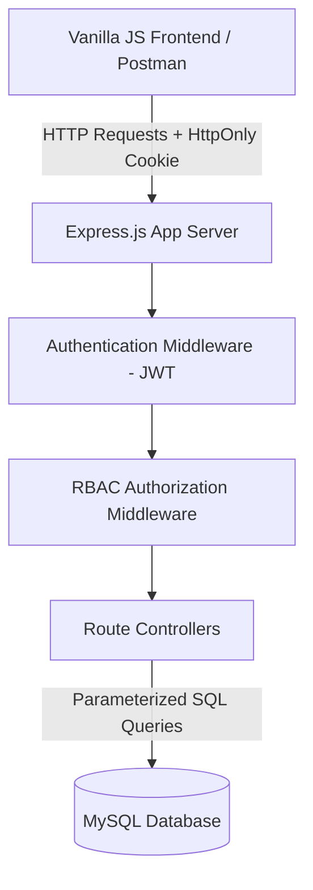
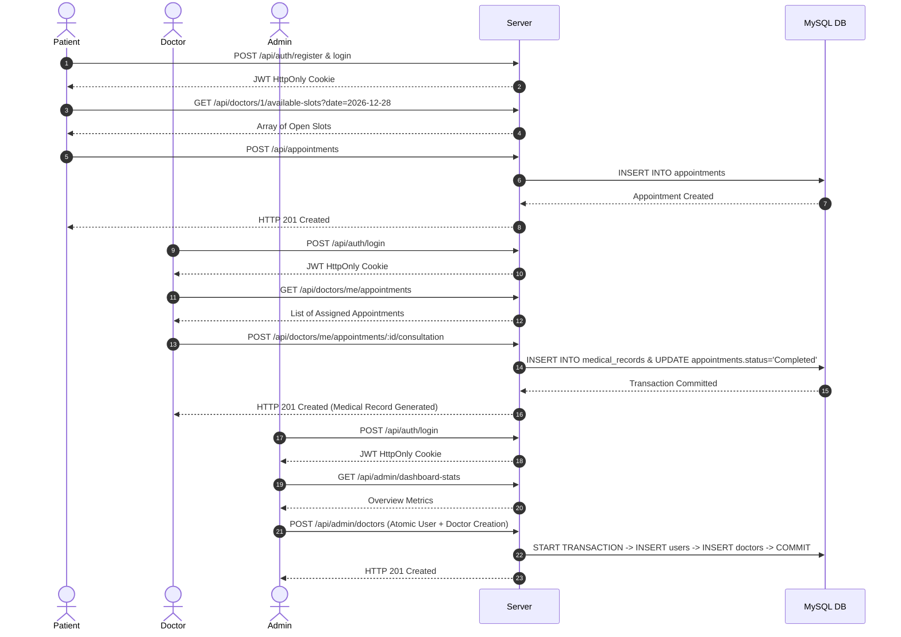

# CareNova Health — Master Project Walkthrough & Verification Report

> **Project Name:** CareNova Health Healthcare / Clinic Management System  
> **Internship Program:** iNeuBytes Major Project  
> **Phase:** Phase 3F — Master System Integration, Final QA & Project Sign-Off  
> **Execution Date:** September 17, 2026  
> **Status:** 100% COMPLETED (22/22 Integration & Regression Tests Passed)  

---

## 1. Executive Summary & Project Overview

**CareNova Health** is a multi-role healthcare management system engineered using a robust **Node.js, Express.js, MySQL, and Vanilla JavaScript** architecture. The application serves three distinct user roles:

1. **Patients:** Self-registration, profile management, browsing clinical departments/doctors, querying available time slots in real time, booking appointments, and viewing personal medical records/prescriptions.
2. **Doctors:** Professional workstation dashboard, appointment management, cross-doctor patient data isolation, executing clinical consultations (recording diagnosis, prescriptions, doctor notes, and follow-up dates), and generating immutable medical records.
3. **Administrators:** Comprehensive system monitoring console, operational analytics & department summary reports, atomic doctor onboarding, patient/appointment management, active-doctor deletion protections, and clinical status transition guardrails.

---

## 2. Approved Technology Stack

The project strictly adheres to the approved, lightweight web technology stack:

* **Backend Framework:** Node.js (v18+) & Express.js
* **Database Engine:** MySQL 8.0+ utilizing native connection pooling via `mysql2/promise`
* **Data Access Layer:** 100% Raw Parameterized SQL queries (No ORM or heavy abstraction layer)
* **Authentication & Authorization:** JSON Web Tokens (JWT) stored in HTTP-Only, SameSite cookies with `bcryptjs` password hashing
* **Frontend Architecture:** HTML5, Vanilla CSS3 (CareNova Custom Design System with Dark Mode support, glassmorphism, responsive CSS Grid/Flexbox), Vanilla JavaScript (ES6+ native Fetch API with async/await)
* **Testing & API Tooling:** Postman Collection (`CareNova_API_Collection.json` with 7 structured folders), Automated Live Integration QA Runner (`scratch/run_phase3f_master_qa.js`)

> [!NOTE]
> No unapproved third-party frameworks or SaaS services (such as React, Vue, Angular, Next.js, PHP, MongoDB, Firebase, Supabase, Tailwind, Bootstrap, or external email/SMS gateways) were introduced into the repository.

---

## 3. Architecture & Security System Design

CareNova Health implements a multi-layered security and architectural design pattern:



### Security & Hardening Safeguards
* **SQL Injection Prevention:** All database queries utilize parameterized placeholder binding (`?`) with `mysql2/promise`.
* **XSS & Token Theft Protection:** JWTs are issued via `HttpOnly`, `SameSite=Lax` cookies, preventing client-side scripts from reading session tokens.
* **Role-Based Access Control (RBAC):** Strict middleware guards (`requireAuth`, `requireRole('patient')`, `requireRole('doctor')`, `requireRole('admin')`) enforce strict endpoint security boundaries.
* **IDOR & Data Isolation Guardrails:** Doctors can only view and manage appointments assigned specifically to them (`doctor_id` ownership verification). Patients can only access their own appointments and medical records (`patient_id` verification).
* **Concurrence & Double-Booking Protection:** Database-level composite unique constraint `(doctor_id, appointment_date, time_slot)` guarantees zero overlapping appointments for any doctor.
* **Clinical Workflow Integrity Guardrails:**
  1. An appointment cannot be marked as `Completed` without an associated doctor consultation and valid `medical_records` entry.
  2. A `Cancelled` appointment cannot be subsequently changed to `Completed`.

---

## 4. Role & Workflow Summary



---

## 5. Database Schema Overview

The relational database model consists of 6 core tables configured with foreign key constraints, cascading rules, and unique indexes:

1. **`users`**: Core authentication credentials and user profile base (`id`, `first_name`, `last_name`, `email`, `password_hash`, `role`, `phone`, `gender`, `is_active`, `created_at`).
2. **`patients`**: Patient role extensions (`id`, `user_id`, `dob`, `blood_group`, `emergency_contact`, `address`).
3. **`doctors`**: Doctor role extensions (`id`, `user_id`, `department_id`, `qualification`, `experience_years`, `consultation_fee`, `bio`, `is_available`).
4. **`departments`**: Clinical departments (`id`, `name`, `description`, `icon`, `is_active`).
5. **`appointments`**: Patient-doctor appointment bookings (`id`, `patient_id`, `doctor_id`, `department_id`, `appointment_date`, `time_slot`, `reason_for_visit`, `status`, `created_at`). *Unique Index: `(doctor_id, appointment_date, time_slot)`*.
6. **`medical_records`**: Immutable clinical encounter notes (`id`, `appointment_id`, `patient_id`, `doctor_id`, `record_code`, `diagnosis`, `prescription`, `doctor_notes`, `recommended_followup_date`, `created_at`).

---

## 6. Comprehensive API Endpoint Dictionary

| Method | Endpoint | Authorization / Role | Description |
| :--- | :--- | :--- | :--- |
| `GET` | `/api/health` | Public | System health check & database status |
| `GET` | `/api/departments` | Public | List all active clinical departments |
| `POST` | `/api/auth/register` | Public | Register a new patient account |
| `POST` | `/api/auth/login` | Public | Authenticate user & issue JWT cookie |
| `POST` | `/api/auth/logout` | Authenticated | Clear session cookie |
| `GET` | `/api/auth/me` | Authenticated | Get currently logged-in user profile |
| `GET` | `/api/patients/me` | Patient | Get patient personal profile |
| `PUT` | `/api/patients/me` | Patient | Update patient profile details |
| `GET` | `/api/doctors` | Public | Filter doctors by department/name |
| `GET` | `/api/doctors/:id` | Public | Get public profile of a doctor |
| `GET` | `/api/doctors/:id/available-slots` | Public | Query open time slots for a given date |
| `GET` | `/api/doctors/me/dashboard` | Doctor | Doctor workstation metrics & today's queue |
| `GET` | `/api/doctors/me/appointments` | Doctor | Get doctor's assigned appointments |
| `GET` | `/api/doctors/me/appointments/:id` | Doctor | Get single appointment details (with IDOR protection) |
| `POST` | `/api/doctors/me/appointments/:id/consultation` | Doctor | Submit diagnosis & create medical record |
| `POST` | `/api/appointments` | Patient | Book a new doctor appointment |
| `GET` | `/api/appointments/my` | Patient | Get patient's personal appointment history |
| `GET` | `/api/appointments/:id` | Patient / Doctor / Admin | Get detailed appointment view |
| `PATCH` | `/api/appointments/:id/cancel` | Patient / Admin | Cancel scheduled appointment |
| `GET` | `/api/medical-records/my` | Patient | Get patient's personal medical records |
| `GET` | `/api/medical-records/:id` | Patient / Doctor / Admin | View specific medical record |
| `GET` | `/api/admin/dashboard-stats` | Admin | High-level system overview stats |
| `GET` | `/api/admin/reports/summary` | Admin | Department-wise operational analytics |
| `GET` | `/api/admin/doctors` | Admin | List all doctors with user profiles |
| `POST` | `/api/admin/doctors` | Admin | Onboard new doctor (Atomic Transaction) |
| `PUT` | `/api/admin/doctors/:id/status` | Admin | Toggle doctor active/inactive status |
| `GET` | `/api/admin/patients` | Admin | List all registered patients |
| `GET` | `/api/admin/appointments` | Admin | System-wide appointment master list |
| `PATCH` | `/api/admin/appointments/:id/status` | Admin | Update appointment status (With Clinical Guardrails) |
| `GET` | `/api/admin/departments` | Admin | List departments (including inactive) |
| `POST` | `/api/admin/departments` | Admin | Create a new clinical department |
| `DELETE` | `/api/admin/departments/:id` | Admin | Delete department (Protected if doctors exist) |

---

## 7. Project Milestones & Lifecycle Summary

* **Task 1 & Task 2:** Database schema design (`database/schema.sql`, `database/seed.sql`), Express app server setup, DB connection pool configuration.
* **Phase 3A (Foundation):** Standardized API response format, central error handler middleware, department listing APIs.
* **Phase 3B (Authentication & RBAC):** Password hashing via `bcryptjs`, JWT token issuance in HttpOnly cookies, auth middleware (`requireAuth`, `requireRole`).
* **Phase 3C (Patient Module):** Patient self-registration, profile updates, slot availability algorithm, appointment booking with double-booking prevention.
* **Phase 3D (Doctor Module):** Doctor workstation dashboard, assigned appointment queues, cross-doctor data isolation, consultation recording, medical record generation.
* **Phase 3E (Admin Module & Hardening):** Admin monitoring metrics, operational reports summary, atomic doctor onboarding transaction, active-doctor deletion safety, and clinical status state guardrails.
* **Phase 3F (Master Integration & QA):** Creation of `07_Master_Integration_Suite` in Postman, implementation of master live runner `run_phase3f_master_qa.js`, execution of 22 end-to-end integration and regression tests, and final documentation sign-off.

---

## 8. Master QA Test Matrix & Live Execution Results

All 22 integration and regression tests were executed against the live Express app server and MySQL database via `node scratch/run_phase3f_master_qa.js`:

```
========================================================================================
CareNova Health — Phase 3F Master System Integration & Regression QA Suite
========================================================================================

--- MODULE 1: SYSTEM HEALTH & PUBLIC DEPARTMENTS ---
[PASS] M1: System Health API (HTTP 200 OK)
[PASS] M1: Public Clinical Departments Listing (HTTP 200 OK)

--- MODULE 2: AUTHENTICATION & ROLE-BASED ACCESS CONTROL (RBAC) ---
[PASS] M2: Patient Self-Registration (HTTP 201 Created)
[PASS] M2: Patient Login Session (HTTP 200 OK + JWT Cookie)
[PASS] M2: Doctor A Login Session (HTTP 200 OK + JWT Cookie)
[PASS] M2: Doctor B Login Session (HTTP 200 OK + JWT Cookie)
[PASS] M2: Admin Login Session (HTTP 200 OK + JWT Cookie)
[PASS] M2: RBAC Enforcement (Patient 403, Doctor 403, Unauthenticated 401)

--- MODULE 3: PATIENT PORTAL & APPOINTMENT BOOKING ---
[PASS] M3: Available Time Slots Query (HTTP 200 OK)
[PASS] M3: Patient Appointment Booking (HTTP 201 Created)
[PASS] M3: Double-Booking Protection Safeguard (HTTP 409 Conflict)
[PASS] M3: Patient Personal Appointments View (HTTP 200 OK)

--- MODULE 4: DOCTOR WORKSTATION & CLINICAL CONSULTATIONS ---
[PASS] M4: Doctor Personal Dashboard & Stats (HTTP 200 OK)
[PASS] M4: Cross-Doctor Data Isolation Guard (HTTP 403 Forbidden)
[PASS] M4: Doctor Consultation Submission & Medical Record Authoring (HTTP 201 Created)
[PASS] M4: Patient Read Access to Medical Records (HTTP 200 OK)

--- MODULE 5: ADMIN CONSOLE, HARDENED CONTROLS & AUDIT REPORTS ---
[PASS] M5: Admin System Dashboard Statistics (HTTP 200 OK)
[PASS] M5: Admin Operational Analytics & Department Summary (HTTP 200 OK)
[PASS] M5: Admin Doctor Onboarding Atomic Transaction (HTTP 201 Created)
[PASS] M5: Department Active-Doctor Deletion Protection Guard (HTTP 400 Bad Request)
[PASS] M5: Admin Status Guardrail: Completion WITHOUT medical record (HTTP 400 REJECTED)
[PASS] M5: Admin Status Guardrail: Cancelled -> Completed (HTTP 400 REJECTED)

Master Data Teardown Completed Cleanly.

========================================================================================
SUMMARY OF MASTER SYSTEM INTEGRATION & REGRESSION QA RESULTS:
TOTAL TESTS EXECUTED: 22
PASS: 22
FAIL: 0
========================================================================================
```

---

## 9. Security & Hardening Verification Audit

1. **Parameterization Check:** Verified 100% of SQL queries across all controllers use parameterized placeholders (`?`).
2. **RBAC & Authorization Audit:** Verified that unauthorized role attempts return HTTP 403 Forbidden or HTTP 401 Unauthorized.
3. **Data Isolation Audit:** Doctor B attempting to view Doctor A's patient appointment returns HTTP 403 Forbidden.
4. **Clinical Workflow Integrity:** Admin status modification endpoint (`PATCH /api/admin/appointments/:id/status`) strictly prevents setting status to `Completed` if no `medical_records` row exists, and blocks transitions from `Cancelled` to `Completed`.
5. **Teardown Verification:** All temporary test accounts, appointments, and medical records created during the master QA execution are automatically cleaned up from MySQL at the end of the test run.

---

## 10. Repository Integrity & Preservation Audit

* **Task-1 & Task-2 Preservation:** Initial Task 1 (`c270d4c`) and Task 2 (`bd4812f`) commits remain intact.
* **Database DDL Schema Stability:** No modifications were made to `database/schema.sql` or `database/seed.sql`.
* **Zero Application Code Changes in Phase 3F:** Application files inside `server/controllers/`, `server/routes/`, `server/middleware/`, and `client/` remained completely untouched during Phase 3F.

---

## 11. Final iNeuBytes Internship Submission Checklist

- [x] All 3 core user roles (Patient, Doctor, Admin) fully functional.
- [x] Postman API Collection updated with all 7 modules (`CareNova_API_Collection.json`).
- [x] Master QA script created and executed (`scratch/run_phase3f_master_qa.js`).
- [x] Comprehensive Walkthrough documentation produced (`walkthrough.md`).
- [x] All 22 automated integration and regression tests passing.
- [x] Zero application source code regressions.
- [x] Zero secrets or credentials exposed in codebase or documentation.
